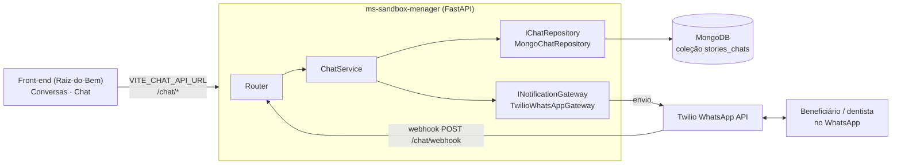
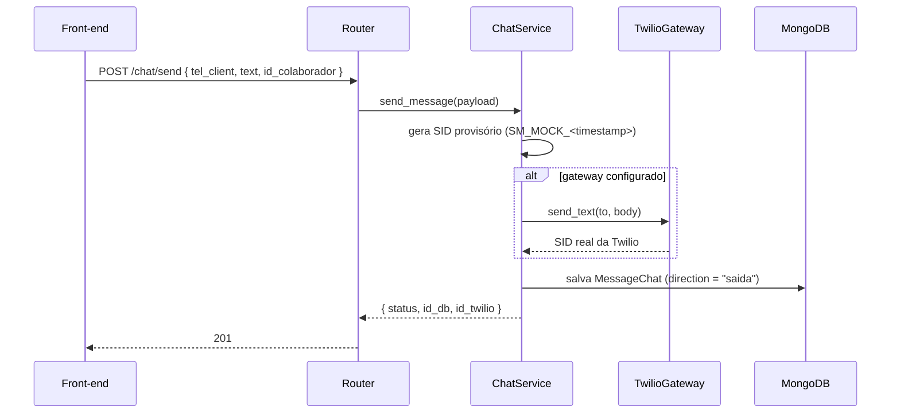
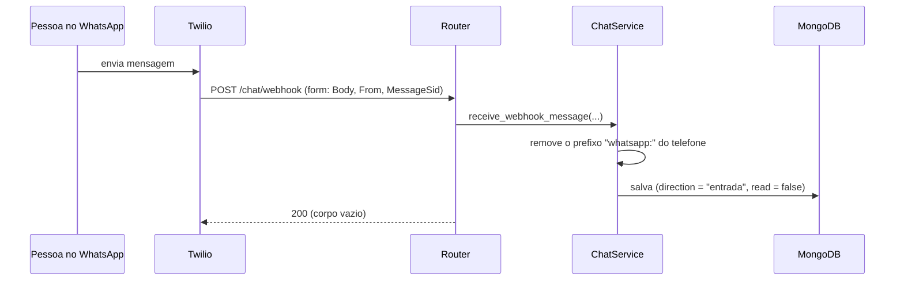

# Arquitetura — ms-sandbox-menager

Microsserviço de comunicação da plataforma Raiz do Bem: envia e recebe mensagens de **WhatsApp** (via Twilio) e guarda o histórico no **MongoDB**. Para instalar, configurar e ver exemplos de chamadas, veja o [README](README.md).

## Sumário

1. [Papel no sistema](#papel-no-sistema)
2. [Camadas](#camadas)
3. [Fluxos](#fluxos)
4. [Modelo de dados](#modelo-de-dados)
5. [Contrato da API](#contrato-da-api)
6. [Configuração](#configuração)
7. [Testes](#testes)
8. [Limitações conhecidas](#limitações-conhecidas)
9. [Como estender](#como-estender)

---

## Papel no sistema



Quem usa: a equipe (`ADMIN` e `COLABORADOR`) pelas telas **Conversas** e **Chat** do front-end. O front mostra o total de não lidas num badge, consultando `GET /chat/conversations` a cada 5 segundos. Veja o `ARCHITECTURE.md` do [front-end](https://github.com/TdB-PlataformaRaizDoBem/Raiz-do-Bem).

O serviço **não tem estado próprio além do MongoDB** e **não conhece beneficiários, dentistas ou pedidos**: identifica conversas apenas pelo telefone (`tel_client`, com `+55` e DDD). Quem traduz telefone em nome é o front-end (`useContactLookup`).

## Camadas

Segue Clean Architecture: as dependências apontam para dentro, e o que é externo (Mongo, Twilio) entra por **interfaces** definidas pelo núcleo.

```
routers  →  services  →  { repositories (interface) , gateways (interface) }  →  domain
                                  ▲                          ▲
                        MongoChatRepository        TwilioWhatsAppGateway
                        (implementação)            (implementação)
```

| Camada | Arquivo | Responsabilidade |
|---|---|---|
| **Router** | [`app/routers/chat_router.py`](app/routers/chat_router.py) | Rotas HTTP, parâmetros, status e tradução de exceções em respostas. Monta o `ChatService` por injeção de dependência (`get_chat_service`) |
| **Service** | [`app/services/chat_service.py`](app/services/chat_service.py) | Regras do chat. Recebe `IChatRepository` e `INotificationGateway` no construtor; não importa `pymongo` nem `twilio` |
| **Interface de repositório** | [`app/repositories/base_repository.py`](app/repositories/base_repository.py) | `IChatRepository`: `save_message`, `search_history_for_tel`, `get_distinct_conversations`, `mark_messages_as_read` |
| **Repositório** | [`app/repositories/mongo_repository.py`](app/repositories/mongo_repository.py) | Implementação em MongoDB (coleção `stories_chats`) |
| **Interface de gateway** | [`app/gateways/base_gateway.py`](app/gateways/base_gateway.py) | `INotificationGateway`: `is_configured`, `send_text`, `send_template`; erros `GatewayNotConfiguredError` e `GatewayRequestError` |
| **Gateway** | [`app/gateways/twilio_gateway.py`](app/gateways/twilio_gateway.py) | Implementação com o SDK da Twilio. Sem credenciais, `is_configured()` devolve `False` em vez de falhar na inicialização |
| **Domínio** | [`app/domain/models.py`](app/domain/models.py) | `MessageChat` (entidade) e DTOs de entrada e saída |
| **Núcleo** | [`app/core/config.py`](app/core/config.py), [`app/core/database.py`](app/core/database.py) | Variáveis de ambiente e cliente do Mongo (`get_database`) |

Trocar o banco ou o provedor de mensagens é implementar a interface correspondente. O `ChatService` não muda.

## Fluxos

### Enviar mensagem (equipe → WhatsApp)



### Receber mensagem (WhatsApp → plataforma)



O webhook **sempre responde `200`**, mesmo se algo falhar (o erro é só registrado no log). Isso evita que a Twilio reenvie a mesma mensagem em loop.

### Ler conversa e marcar como lida

1. `GET /chat/conversations`: agrega no Mongo a **última mensagem de cada telefone** e conta as de entrada com `read = false` (`unread_count`), ordenado da mais recente para a mais antiga.
2. `GET /chat/history/{tel}?skip=0&limit=20`: histórico paginado. O Mongo devolve do mais recente para o mais antigo; o serviço **inverte o lote**, então a resposta vem em ordem cronológica.
3. `PUT /chat/read/{tel}`: marca como lidas as mensagens de **entrada** daquele telefone.

### Iniciar conversa por template

`POST /chat/initiate` envia o *template* aprovado do WhatsApp (`TWILIO_TEMPLATE_SID`) com dois parâmetros (`param_1` e `param_2`). Isso abre a janela de 24 h, necessária porque o WhatsApp só permite texto livre depois que a pessoa escreveu ou que um template abriu a conversa. Sem gateway configurado, responde `503`; se a Twilio recusar, `400`.

> O front-end **não chama** este endpoint hoje: ele só usa `history`, `send`, `conversations` e `read`.

## Modelo de dados

Coleção `stories_chats` (banco `MONGO_DB_NAME`, padrão `db_raiz_do_bem`), um documento por mensagem:

| Campo | Tipo | Descrição |
|---|---|---|
| `_id` | ObjectId | Exposto como `id_db` (string) |
| `id_message_twilio` | string | SID da Twilio; `SM_MOCK_…` quando o envio não passou pela Twilio |
| `tel_client` | string | Telefone com `+55` e DDD. É a chave da conversa |
| `text` | string \| null | Conteúdo |
| `id_colaborador` | int \| null | Quem enviou. `null` nas mensagens de entrada. O id vem da API principal |
| `direction` | `"entrada"` \| `"saida"` | Sentido |
| `date_time` | datetime (UTC) | Instante do registro |
| `read` | bool | `false` só nas mensagens de entrada ainda não vistas. O padrão é `true`, para que mensagens antigas (sem o campo) não contem como não lidas |

Não há índices declarados no código. O histórico filtra por `tel_client` e ordena por `date_time`; se a coleção crescer, um índice composto nesses dois campos é o primeiro passo.

## Contrato da API

Documentação interativa em `/docs`. Prefixo `/chat`.

| Método | Rota | Corpo / parâmetros | Resposta |
|---|---|---|---|
| `POST` | `/chat/send` | `{ tel_client, text, id_colaborador? }` | `201` `{ status, id_db, id_twilio }` |
| `POST` | `/chat/webhook` | Formulário da Twilio: `Body`, `From`, `MessageSid` | `200` vazio |
| `GET` | `/chat/history/{tel}` | `skip` (0), `limit` (20) | Lista de `MessageResponse`, em ordem cronológica |
| `POST` | `/chat/initiate` | `{ tel_client, param_1, param_2, id_colaborador? }` | `200` `{ status, id_db, id_twilio }`, `503` ou `400` |
| `GET` | `/chat/conversations` | — | Lista de `ConversationPreviewResponse` |
| `PUT` | `/chat/read/{tel}` | — | `{ status, messagens_updated }` |
| `GET`/`HEAD` | `/` | — | Verificação de saúde |

Telefones na URL devem ir codificados (`%2B55…`); o `history` aplica `unquote` para tolerar dupla codificação.

## Configuração

Variáveis lidas de `.env` por `app/core/config.py` (modelo em [`.env.example`](.env.example)):

| Variável | Descrição |
|---|---|
| `MONGO_URI` | String de conexão do MongoDB (Atlas ou local) |
| `MONGO_DB_NAME` | Nome do banco (padrão `db_raiz_do_bem`) |
| `TWILIO_ACCOUNT_SID`, `TWILIO_AUTH_TOKEN` | Credenciais. Sem elas o serviço sobe, mas `is_configured()` é `False` |
| `TWILIO_NUMBER` | Remetente WhatsApp (padrão: número do *sandbox* da Twilio) |
| `TWILIO_TEMPLATE_SID` | SID do template usado em `/chat/initiate` |

**CORS** (em `app/main.py`): origens `https://raiz-do-bem.vercel.app`, `http://localhost:5173` e `http://127.0.0.1:5173`; métodos `GET`, `POST`, `PUT`, `DELETE`, `OPTIONS`. O middleware é registrado antes dos routers e o handler global de exceção devolve `JSONResponse`, para que mesmo respostas `500` levem os cabeçalhos CORS (senão o navegador mascara o erro real como "CORS error").

**Webhook em desenvolvimento:** a Twilio precisa alcançar `/chat/webhook`. Em máquina local, exponha a porta com um túnel (ngrok) e cadastre a URL pública no console da Twilio. Veja o README.

## Testes

```bash
pip install -r requirements-dev.txt
pytest
```

| Pasta | O que cobre | Como isola |
|---|---|---|
| `tests/unit/test_chat_service.py` | Regras do `ChatService` | `FakeChatRepository` e `FakeNotificationGateway` (`tests/fakes.py`), sem Mongo nem Twilio |
| `tests/unit/test_mongo_repository.py` | Consultas e agregação | `mongomock` |
| `tests/unit/test_models.py` | DTOs e entidade | — |
| `tests/integration/test_chat_router.py` | Rotas ponta a ponta (envio, webhook, histórico, `initiate`, conversas e leitura) | `TestClient` com `dependency_overrides` para o banco (`mongomock`) e para o gateway |

Nenhum teste usa rede. A injeção de dependências é o que torna isso possível.

## Limitações conhecidas

Registradas aqui para quem for operar ou evoluir o serviço. São o comportamento atual do código, não decisões de projeto.

| Tema | Situação atual | Efeito |
|---|---|---|
| **Sem autenticação** | Nenhuma rota valida o JWT, embora o front-end o envie | Quem alcançar a URL lê e envia mensagens. A CORS não substitui autenticação |
| **Webhook sem validação** | `/chat/webhook` não confere a assinatura `X-Twilio-Signature` | Qualquer origem pode injetar mensagens de entrada |
| **Falha no envio é silenciosa** | Em `send_message`, se a Twilio falhar, o erro é só impresso e a mensagem é **gravada mesmo assim**, com SID `SM_MOCK_…` | A tela mostra "enviada" para uma mensagem que pode não ter saído. O mesmo ocorre sem credenciais, o que serve ao desenvolvimento, mas esconde problemas em produção |
| **Detalhe de erro exposto** | O handler global e as rotas devolvem `str(exc)` ao cliente | Pode vazar detalhes internos |
| **Template com texto fixo** | O texto salvo em `initiate` é `"Your appointment is coming up on {param_1} at {param_2}"` (o template de exemplo do *sandbox*) | Precisa ser ajustado ao template real aprovado |
| **Logs com `print`** | Erros vão para a saída padrão, sem `logging` estruturado | Difícil de filtrar e alertar |
| **Sem índices** | Veja [Modelo de dados](#modelo-de-dados) | Consultas ficam lentas com muito histórico |

## Como estender

- **Novo provedor de mensagens** (por exemplo, outro canal): implemente `INotificationGateway` e troque a dependência em `get_chat_service`.
- **Outro banco**: implemente `IChatRepository`.
- **Novo caso de uso**: adicione o método ao `ChatService` e uma rota fina no router. Teste primeiro com os fakes de `tests/fakes.py`.
- **Autenticar as rotas**: adicione uma dependência do FastAPI no router que valide o JWT emitido pela API principal.
